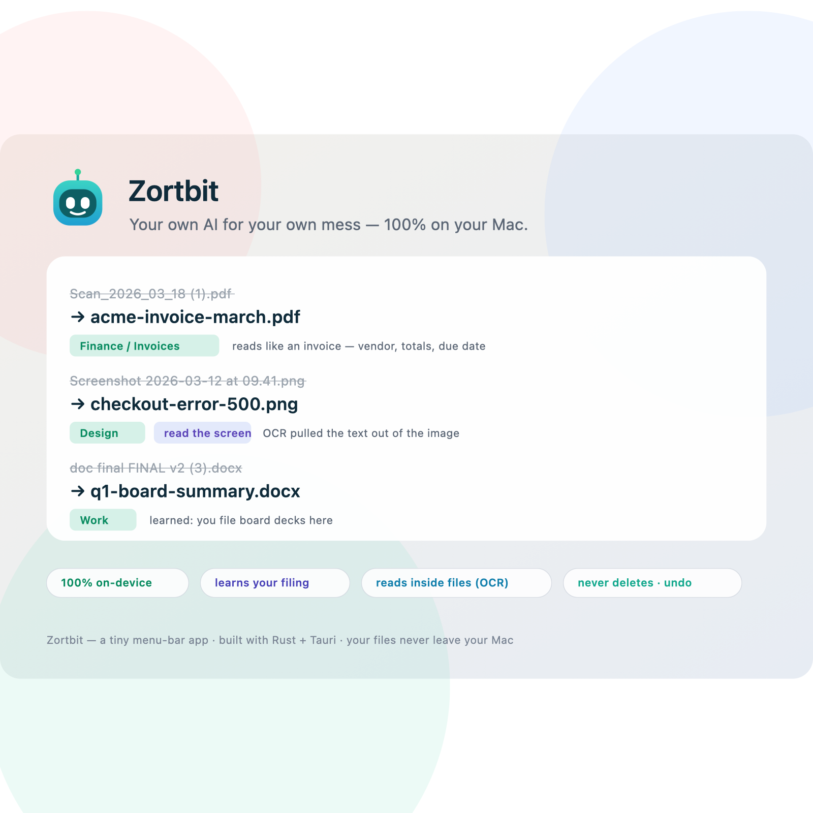

<div align="center">

# Zortbit 🤖

### Your own AI for your own mess.

**It learns how *you* file things — and does it 100% on your Mac.**


&nbsp;
&nbsp;
&nbsp;



</div>

Zortbit is a tiny macOS menu-bar app that watches your Downloads, reads what files actually
*are* (OCR for screenshots, text for documents), and proposes a tidy name plus the right
folder — using a **local** model. Nothing leaves your machine, nothing is ever permanently
deleted, and every move is reversible.

## Why

Folders fill up with `Scan_2026_03_18 (1).pdf` and `Screenshot 2026-… .png`. Rule-based
organizers can't tell what's *inside* a file, and cloud "AI organizers" send your
documents off your device. Zortbit does it locally and gets better as it learns which
folders you actually approve.

## Features

- 🧠 **Content-aware** — Apple Vision OCR reads screenshots/images; built-in macOS tools
  read PDF / DOCX / PPTX / RTF — so files sort by what they contain, not just their name.
- 🗂️ **Project-aware** — a small local model files into *your* folders, and learns from
  what you approve over time.
- 🔒 **Local-first & private** — runs entirely on your Mac. Files never leave the device.
- ↩️ **Safe by design** — propose-first (nothing moves until you approve); **never**
  permanently deletes (Trash only, with one-click Undo); sensitive files (keys,
  credentials, `.env`) are quarantined locally and never sent to a model.
- 🪶 **Lightweight** — a menu-bar popover that sleeps when idle; the model loads on demand.

## Requirements

- macOS 13+ (Apple Silicon)
- [Rust](https://rustup.rs) and [Node.js](https://nodejs.org)
- [Ollama](https://ollama.com) with a local model: `ollama pull qwen2.5:7b`
  (a 7B model classifies noticeably better than 3B; use `qwen2.5:3b` on low-RAM machines)
- Xcode Command Line Tools (`xcode-select --install`) — builds the OCR sidecar.
  Optional: without it, Zortbit still files by name and type.

## Run (dev)

```sh
ollama serve &          # start the local model server
npm install
npm run tauri dev
```

Zortbit appears in your menu bar — click the icon, then **Scan my mess**.

## Build a .app

```sh
npm run tauri build -- --bundles app
# → src-tauri/target/release/bundle/macos/Zortbit.app
```

## How it works

1. **Learns your folders** — Zortbit reads your real folder structure (`learn_roots`) and
   fingerprints what already lives in each (filenames + a light content sample). Code repos and
   dumps are skipped. This *is* your taxonomy — discovered from your machine, not configured.
2. A file watcher (FSEvents) wakes on new files in your scanned folders; content is extracted
   **locally** — Vision OCR for images, built-in tools for documents.
3. **Places by resemblance** — the new file is scored against every folder's fingerprint and
   filed into the one it most resembles, with a reason you can see (*"resembles your Joblar
   folder — shares: construction, matching"*). A local model is the fallback for novel files.
4. You approve; the move is logged so it stays reversible and Zortbit keeps learning your style.

## Configuration

Edit `~/Library/Application Support/com.xaviour.zortbit/config.json`:

| Key | Meaning |
|---|---|
| `learn_roots` | Folders whose subfolders Zortbit learns as your taxonomy + fingerprints |
| `categories` | Optional manual category list — **auto-discovered from `learn_roots` when empty** |
| `category_help` | Optional one-line meaning per category (override for the fallback model) |
| `rules` | Optional `{ "contains": "…", "category": "…" }` list — deterministic filename routing, applied **before** the model |
| `bulk_scope` | Folders to scan |
| `protected` | Folders Zortbit must never touch |
| `organize_base` | Where organized files go (default `~/Organized`, kept local) |
| `model` | The model id (e.g. `qwen2.5:7b`) |
| `provider` | `ollama` (default) or `openai` for any OpenAI-compatible server |
| `endpoint` | OpenAI-compatible chat URL (used when `provider` is `openai`) |
| `automation` | `propose` (default) · or `auto` to file trusted patterns in the background |

### It learns your folders automatically

By default Zortbit discovers your taxonomy from `learn_roots` and files new items by how much they
resemble what's already in each folder — no setup. The `category_help` and `rules` below are
**optional overrides** for when you want to force something:

```json
{
  "category_help": ["Finance: invoices, receipts, statements, tax"],
  "rules": [{ "contains": "invoice", "category": "Finance" }]
}
```

A `rules` entry is matched against the filename **before** the model runs, so named-by-project
files (`invoice-*.pdf`, `acme-*.docx`) never depend on the model guessing right.

### Use any local model — Ollama, Foundry Local, LM Studio…

Zortbit talks to a local model server. By default that's [Ollama](https://ollama.com). To use
any other **OpenAI-compatible** local server — including **Microsoft Foundry Local**, LM Studio,
or `llama.cpp`'s server — set this in `config.json`:

```json
{ "provider": "openai", "endpoint": "http://localhost:PORT/v1/chat/completions", "model": "your-model" }
```

For Foundry Local, start the service and read its endpoint from `foundry service status`, then
drop that URL in. Everything still runs on your machine — nothing goes to the cloud.

### Automatic mode (it learns)

By default Zortbit is **propose-first** — nothing moves until you approve. Once it has seen you
approve the same kind of move a few times, set `"automation": "auto"` and it will **file those
trusted, high-confidence moves silently in the background** as new files arrive. It will **never**
auto-delete and **never** auto-touch sensitive files — those always wait for your explicit ok.

## Roadmap — what's coming

- **Gentle Mode scheduler** (the "Gentle · 3%" in the screenshot) — tidy quietly in the
  background, throttled by system load, with an ETA and a heads-up before shutdown.
- **One-click model presets** in onboarding — pick Ollama, Microsoft Foundry Local, or LM Studio
  without hand-editing config.
- **Pin-your-own rules** — "always send invoices to Finance", "never touch `~/Code`".
- **Signed & notarized `.app`** + auto-update, so it shares without Gatekeeper warnings.
- **Optional local vision model** for photos that have no text.
- **Windows & Linux** builds.
- A weekly **tidy digest** — what got filed, and what's still waiting on you.

Ideas and PRs for any of these are very welcome.

## Contributing

Issues and PRs welcome. Built with Rust and [Tauri](https://tauri.app).

## License

[MIT](LICENSE) © 2026 Christopher Herrera Magana
